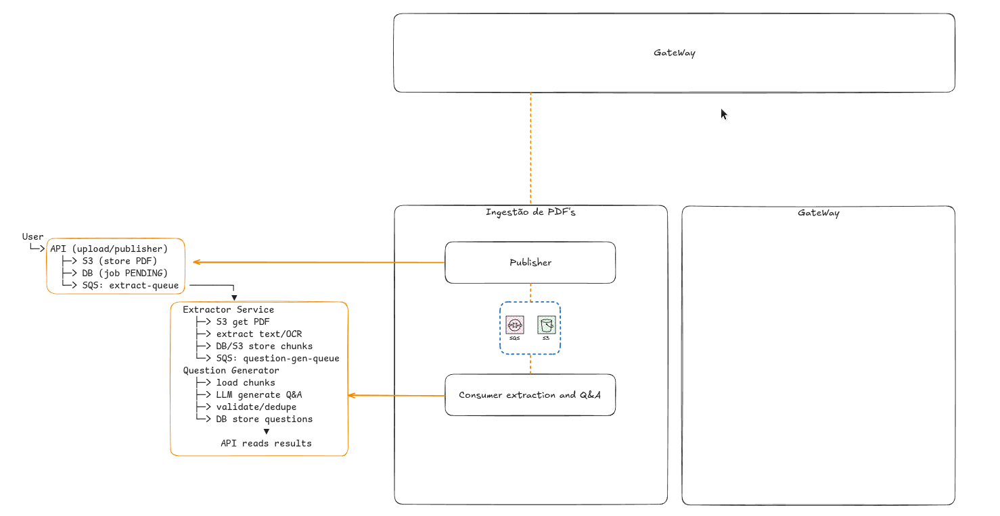

# Pipeline de Ingestão de PDF (Genérico)

Este projeto implementa um fluxo assíncrono para ingestão de um ou vários PDFs enviados por usuário, com extração de conteúdo e geração de respostas/itens estruturados a partir desses documentos.



## Visão geral

De forma resumida:

1. O usuário envia um ou mais PDFs como provas (ou documentos de referência) pela API.
2. O sistema registra o job e armazena os arquivos no storage.
3. Um pipeline de ingestão processa os PDFs, extrai o conteúdo e organiza em partes (chunks).
4. Um gerador de perguntas/respostas usa o conteúdo extraído para produzir respostas estruturadas.
5. Os resultados são validados, deduplicados e persistidos.
6. A API expõe o status e os resultados para consumo do serviço cliente.

## Fluxo do sistema

1. **Entrada (API / Publisher)**
- Recebe upload de PDF(s).
- Salva arquivos em storage (ex.: S3).
- Cria registro de processamento no banco com status inicial (ex.: `PENDING`).
- Publica mensagem em fila para iniciar a extração.

2. **Extração (Extractor Service)**
- Consome a fila de extração.
- Baixa o PDF do storage.
- Extrai texto (com OCR quando necessário).
- Divide o conteúdo em chunks e persiste.
- Publica mensagem para etapa de geração de Q&A.

3. **Geração de Respostas (Question Generator / Consumer)**
- Consome eventos da fila de geração.
- Carrega chunks extraídos.
- Gera perguntas e respostas com modelo de linguagem.
- Valida e remove duplicidades.
- Salva resultados finais no banco.

4. **Consulta de Resultado (API)**
- Disponibiliza status do job.
- Retorna respostas geradas associadas aos PDFs enviados.

## Componentes lógicos

- **API Gateway / Publisher**: ponto de entrada para upload e consulta.
- **Storage**: persistência de arquivos originais.
- **Fila (Queue)**: desacoplamento entre etapas.
- **Serviço de Extração**: leitura/OCR e preparação do conteúdo.
- **Serviço de Geração**: criação de respostas estruturadas.
- **Banco de Dados**: jobs, chunks e resultados.

## Por que essa arquitetura é genérica

O desenho foi pensado para ser reaproveitado em múltiplos domínios além de provas, por exemplo:

- análise de contratos,
- processamento de laudos,
- extração de conhecimento de manuais,
- criação de base de perguntas para atendimento.

A troca de domínio acontece principalmente em três pontos:

- **prompt/regras de geração**,
- **esquema de validação dos resultados**,
- **formato de saída esperado pelo serviço consumidor**.

Ou seja, o pipeline de ingestão (upload -> extração -> geração -> persistência) permanece o mesmo, e só a camada de negócio específica muda.

## Subindo Kafka com Docker Compose

Para evitar subir o Kafka manualmente, use o `docker-compose.yml` da raiz do projeto:

```bash
docker compose up -d
```

Interface web do Kafka:

- URL: `http://localhost:8080`

Para parar/remover o container:

```bash
docker compose down
```
